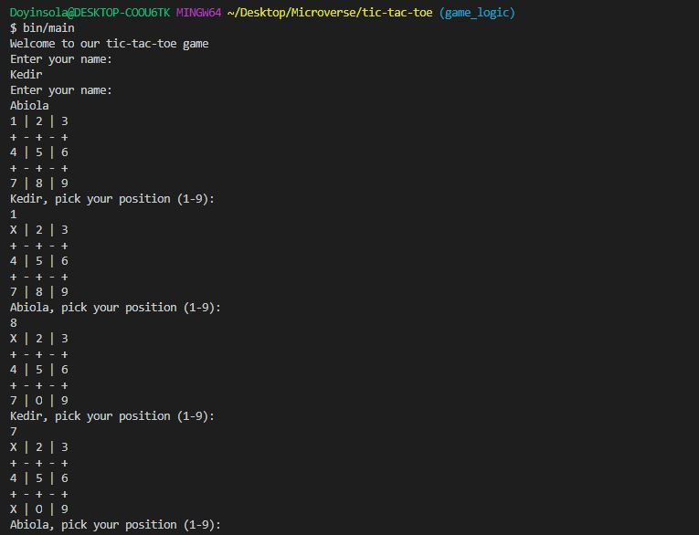
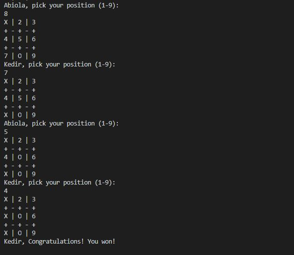

# tic-tac-toe
This file contains the game Tic-Tac-Toe using Ruby

## Screenshots



## Built With

- RUBY

## Getting Started

#### 🛠 Installing

Clone and run this repository by running these commands on the terminal:

```
- git clone https://github.com/Abidoyinsola1/tic-tac-toe;
- cd tic-tac-toe
- Run bin/main
```

### Game rules

- Only two players are allowed to play at a time.
- Players should input their names to get started on the game.
- The board has 9 empty cells
- There are two symbols — "X" and "O" that represents the first and the second players
- Players take turns playing by entering their numbers represented by the symbols into empty cells.
- Negative numbers, symbols, letters... are not allowed.
- The first player to get three of his/her tokens in a row (up, down, across, or diagonally) is the winner.
- The game ends in a tie if all nine cells are occupied and there is no winner.

### How do we play Tic Tac Toe

- Players take turns playing.
- 1st turn — Player 1
- Player 1 will be asked to choose their position. The position could be any number from 1 - 9.
- 2nd turn — Player 2.
- Player 2 will be asked to choose their position. The position could be any number from 1 - 9, except they can’t touch the number that Player 1’s symbol already fills.
- 3rd turn- Player 1…. The cycle continue until a player wins or there’s a tie game.
- There are 8 winning combinations: Top row, Middle row, Bottom row, Left column, Middle column, Right column, Left diagonal, and Right diagonal.
- There’s a draw/tie when the entire board is filled with X’s and O’s but no winning combinations can be found.

## Authors

👤 **Adeyemi Abiola Doyinsola**

- Github: [@Abidoyinsola1](https://github.com/Abidoyinsola1)
- Twitter: [@Abidoyinsola](https://twitter.com/abidoyinsola)
- LinkedIn: [Doyinsola Abiola Adeyemi](https://www.linkedin.com/in/doyinsola-adeyemi)

👤 **Kedir Abdurahman**
- Github: [@keddo](https://github.com/keddo)
- Twitter: [@kedirman](https://twitter.com/kedirman)
- Linkedin: [Kedir Abdurahman](https://linkedin.com/in/kedirabdurahman/)

## 🤝 Contributing

Contributions, issues and feature requests are welcome!

Feel free to check the [issues page](https://github.com/luciano-ilha/Tic-Tac-Toe/issues).

## 👍 Show your support

Give a ⭐️ if you like this project!

## 📝 License

This project is free to use as learning purposes. For any external content (e.g. logo, images, ...), please contact the proper author and check their license of use.